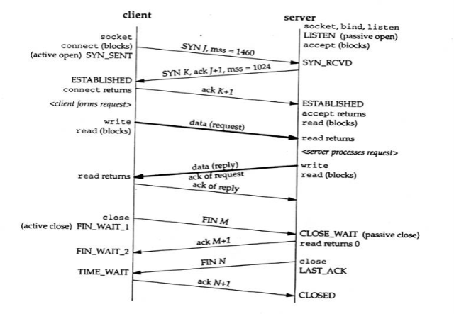

# KKITALK
**💬 끼톡 – 다자간 실시간 대화 프로그램**


| 구분       | 내용                              |
|------------|-----------------------------------|
| 프로젝트명 | 끼톡 -다자간 실시간 대화 프로그램 |
| 개발기간   | 2017.06.05 ~ 2017.06.16           |
| 개발인원   | 6명                               |
| 플랫폼     | Windows                           |
| 개발 언어  | Java                              |
| 개발 도구  | Eclipse                           |

## 프로젝트 설명

[](http://www.youtube.com/watch?v=tdBGUWQJTuI "Project Introduction")
> 사진을 클릭하시면 시연 영상을 보실 수 있습니다.


### 1. 특징

교실이나 사내에서 간단하게 사용할 수 있는 메신저 프로그램으로 인터넷이 사용이 불가능한 상황에도 동작한다.

### 2. 서버의 통신다이어그램 순서

서버개설(포트번호 입력) -> ID/PW 수신 -> 로그인 -> 채팅 순서이며 클라이언트로부터 회원 가입을 원할 경우 서버개설(포트번호 입력) -> ID/PW/NICKNAME 수신 -> 회원가입 -> 로그인 -> 채팅 쓰레드 시작

### 3. 클라이언트의 통신다이어그램 순서

서버접속(IP/PORT번호 입력) -> 로그인 or 회원가입 -> 로그인 -> 채팅

멤버 관리를 위해 MySQL 데이터베이스를 사용했다. 중복 아이디, 중복 닉네임 방지를 위해 데이터베이스에 등록된 아이디와 닉네임을 비교하는 기능이 있다.



컨트롤러 역할을 하는 클래스는 기본 통신 다이얼로그에서 착안하여 채팅 전까지의 서버 대 클라이언트 통신을 구현하였다.  서버와 클라이언트가 문자열 명령어를 주고 받으며 객체가 회원가입을 위한 것인지 로그인을 위한 것인지 구분하는 기능을 구현 했다.


## 라이선스
```
MIT License

Copyright (c) 2020 Heavy Bros. 

Permission is hereby granted, free of charge, to any person obtaining a copy
of this software and associated documentation files (the "Software"), to deal
in the Software without restriction, including without limitation the rights
to use, copy, modify, merge, publish, distribute, sublicense, and/or sell
copies of the Software, and to permit persons to whom the Software is
furnished to do so, subject to the following conditions:

The above copyright notice and this permission notice shall be included in all
copies or substantial portions of the Software.

THE SOFTWARE IS PROVIDED "AS IS", WITHOUT WARRANTY OF ANY KIND, EXPRESS OR
IMPLIED, INCLUDING BUT NOT LIMITED TO THE WARRANTIES OF MERCHANTABILITY,
FITNESS FOR A PARTICULAR PURPOSE AND NONINFRINGEMENT. IN NO EVENT SHALL THE
AUTHORS OR COPYRIGHT HOLDERS BE LIABLE FOR ANY CLAIM, DAMAGES OR OTHER
LIABILITY, WHETHER IN AN ACTION OF CONTRACT, TORT OR OTHERWISE, ARISING FROM,
OUT OF OR IN CONNECTION WITH THE SOFTWARE OR THE USE OR OTHER DEALINGS IN THE
SOFTWARE.

```
